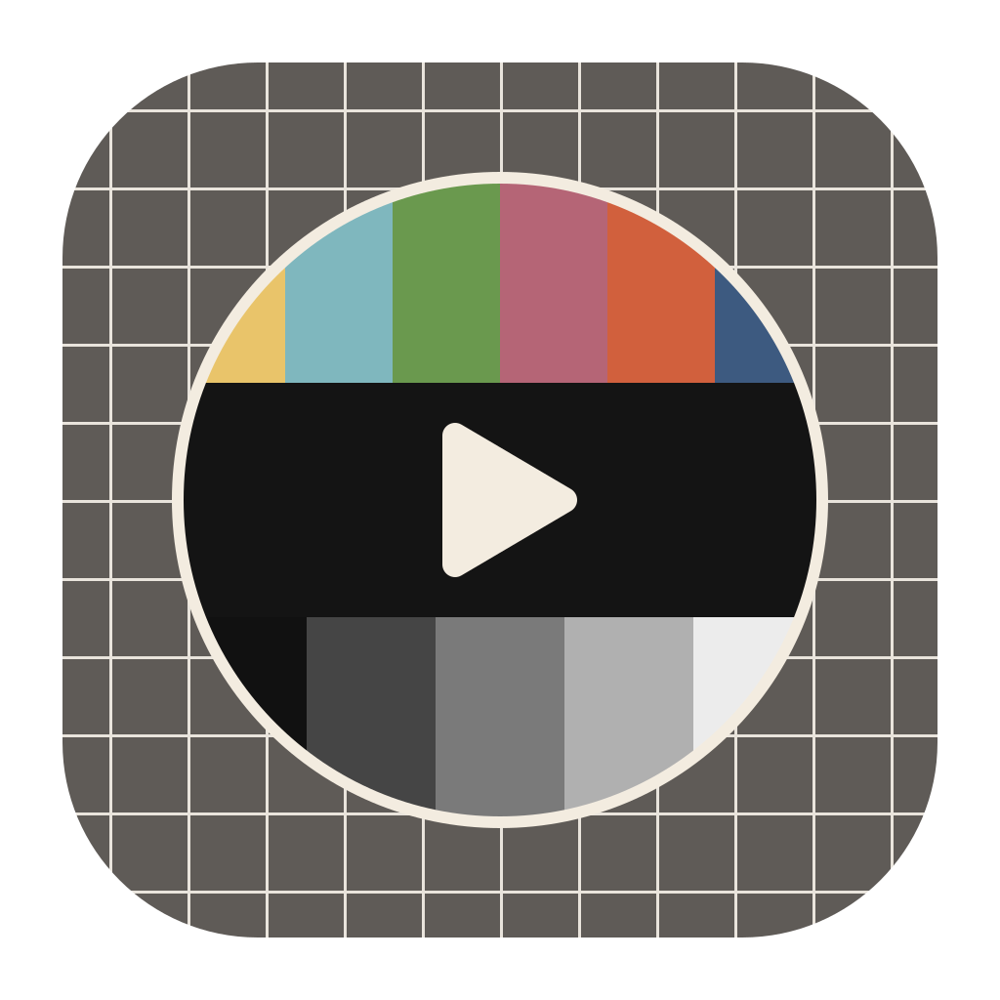

# Fjernsyn

Fjernsyn is a desktop YouTube client for Windows, macOS and Linux. It talks to YouTube directly, or through an Invidious instance, and keeps your subscriptions, profiles, history and playlists in files on your own machine. There is no account and no login.

I built it around how I watch. Everything my subscriptions publish goes into one stream, and I can keep a few hundred channels sorted into profiles. Playback recovers when YouTube stops trusting a session, comments load as I scroll, and the download button hands the video to yt-dlp.

Fjernsyn is Norwegian (and Danish) for television, literally "far-sight", tele-vision translated word for word.

## Download

Every push to `main` builds Fjernsyn for Windows, macOS and Linux. There are no releases. Pick the newest [build workflow run](https://github.com/TomasEkeli/Fjernsyn/actions/workflows/build.yml) and download the artefact for your platform. You need a GitHub account to download it. The builds are unsigned, so Windows and macOS warn you the first time you open them.

## Where it comes from

Fjernsyn started as a fork of [FreeTube](https://github.com/FreeTubeApp/FreeTube), and most of it still comes from there: the application programming interface (API) layer, the player, the settings and nearly all of the interface. I merge FreeTube's development branch as it moves, bringing its fixes and features into Fjernsyn alongside my own changes. Credit for FreeTube belongs to its contributors.

The FreeTube team has no part in Fjernsyn, so please do not take problems with it to them. If you want FreeTube itself, go to the [official project](https://github.com/FreeTubeApp/FreeTube), with downloads at [freetubeapp.io](https://freetubeapp.io/#download).

The version numbers started again at 0.0.1 when it got its own name.

### Coming from FreeTube

Fjernsyn installs beside FreeTube and keeps its data in a folder of its own, so the two run on one machine without touching each other's data.

On its first launch it copies what it finds in FreeTube's data folder: subscriptions, profiles, history, playlists and settings, along with any yt-dlp, ffmpeg and Deno installed there. FreeTube keeps its original data, and from then on the two apps keep their data apart.

Flatpak and Snap installations of FreeTube keep their data inside a sandbox, where Fjernsyn does not look. For those, export from FreeTube and import into Fjernsyn.

Exports are named `fjernsyn-*.db` and use FreeTube's format, so each app imports the other's.

Fjernsyn opens its own `fjernsyn://` links and the `freetube://` links that browser redirect extensions send. Both apps claim `freetube://` links each time they start, so the one started last gets them. Switch this off in Fjernsyn's general settings to leave them to FreeTube.

Builds of this repository from before the rename were called FreeTube. Windows sees Fjernsyn as a different app, so it installs beside such a build, and the old one has to be uninstalled by hand.

## Features

### Playback

YouTube's server-side adaptive bitrate (SABR) streaming stops trusting a playback session now and then. Fjernsyn retries, gets fresh credentials and rebuilds the manifest, reloading the page only when it has run out of options. All player reloads go through this recovery process. The player shows "Reconnecting to YouTube" while it works.

Fjernsyn retries failed proof of origin (PO) token requests and handles YouTube's captcha by taking the challenge from the homepage. It recovers live streams that come back without a web manifest, and unreadable metadata does not stop playback. The error screen says what failed and offers Try Again.

The player uses shaka-player 5.2 for a fix the 5.1 line never got: request headers stay isolated across retry attempts, which every SABR request depends on. Playback speed has a slider with half-step presets beside it. Keyboard shortcuts use the configured rate interval.

Some videos are inaudible at 100% volume. Fjernsyn's volume bar goes up to a configurable ceiling of 1000% (+20 decibels).

Optional loudness normalisation corrects each video for how loud it was mastered (YouTube provides this information), which also turns very loud videos down. It is off by default, but I have it on.

A small pin on the control bar keeps the player's controls from fading, and the choice sticks between videos.

### SponsorBlock

Some channels read their sponsors as part of the show. You can change SponsorBlock skipping per channel, for those where the ads are actually fun and cool. The switch is on the channel page and on the video you are watching. SponsorBlock settings list the channels you have changed, and you can remove any of them there.

### Subscriptions

Videos, shorts, live streams and posts share one feed. A row of filters turns each kind on and off. Every refresh fetches all four, so switching one on is instant.

On refresh, the subscription list keeps its old entries while the new ones come in.

If one service reports a channel as terminated, Fjernsyn checks an independent endpoint. Without confirmation, it keeps the cached data and retries later. If too many channels come back as terminated in one refresh, it stops accepting those reports and checking them. During an outage this saves several hundred pointless requests.

Scheduled premieres and live streams are in a shelf over the other videos, collapsed by default, and "Hide Upcoming Premieres" does what it says.

### Channels and profiles

With a few hundred subscriptions, a checkbox list of every channel is unusable, and my profiles went stale. The Channels page is a place to sort channels into profiles.

Every profile is a bubble along the top. Click one to open its column. Open as many as you like; the columns scroll sideways once they do not fit. Each window keeps its own open columns, so you can work on different profiles in different windows.

Channels in no profile sit in an Unassigned column on the left, which goes away once it is empty. The goal is every channel in a profile.

Drag a channel to another column to move it, or hold Ctrl to copy it. Drop it on a bubble to file it without opening the column, or on the trash to unsubscribe, after confirmation. The Move to and Copy to menus do the same with the keyboard.

Click to select, Shift-click for a range, or use Select all on a column; dragging any selected channel moves the whole selection. The search box narrows every column at once, and each bubble shows how many of its channels match.

A channel in more than one profile sorts to the top of each column it is in. When two of those columns are open, both copies share a colour, so the pairs are easy to spot. Right-click one to remove it from that profile, or keep it there and remove it from all the others.

Double-click a channel to visit its page. Click a column's heading to make that profile active.

Click New profile at the end of the strip and type its name there. New profiles go at the end. Right-click a bubble to rename it, change its colour or remove it. Removing a profile leaves its channels subscribed, and those in no other profile go back to Unassigned.

Drag bubbles to put profiles in your own order, or move the focused one with Ctrl+Shift+Left and Right. Every profile list in the app follows that order. A bar shows where a dragged bubble will land. Chromium sometimes loses drops, so Fjernsyn catches those itself.

Suggest profiles replaces the profile columns with proposed ones, drawn with dashed edges:

- Unassigned channels that fit one of your profiles.
- Channels that fit another profile clearly better than their own, badged with where they are now.
- Groups for a new profile, by YouTube category or by a shared tag.

Suggestions use the tags from channel pages fetched during a refresh and the categories of videos you watch. They need no extra requests and get better as you go. Hover a channel to see why it is there.

Nothing changes until you act:

- Tick a channel to file it.
- Click its cross to dismiss the suggestion for that channel permanently.
- Tick a heading to accept the whole suggestion.
- Drop a channel on a suggestion to include it when you accept the rest.

Each column, including Unassigned, has a Probe button for channels the app knows too little about. It checks three recent videos from each channel, one request at a time, and saves what it finds with the channel. It runs in the background as suggestions fill in, never during subscription refreshes, and stops the moment YouTube pushes back.

Probing a second column queues it behind the first. Press Probe again after a stop to pick up where it left off.

Set the default profile in the profile settings.

### Explore

Explore shows every trending category at once. The categories come from what YouTube's own guide offers here, plus the categories it serves without mentioning them.

You can change region on the page, and the last four you looked at stay a click away. Pinned regions stay there and do not count towards the four, so you can pin the places you care about and still wander.

### Layout

Navigation is in the top bar, which gives the page the full width of the window. The control row stays on screen while you scroll.

Cards come in tight, standard, spacious and wall density. Wall packs spacious-sized thumbnails edge to edge with the text over them. I use wall with full window as the default viewing mode, so the app mostly gets out of the way.

Hover over a video card to show a tick beside the playlist buttons. Click it to mark the video as watched, or remove it from history if it is already there. I removed the external player button from the cards because I never used it.

### Comments

With the local API, comments load as you scroll. Each thread opens with its first few replies and a button to load the rest. Only visible threads load, so a page of twenty threads does not fire twenty requests at once. With Invidious, you click to load comments.

You cannot post comments, since there is no login.

### Downloads

The download button hands the video to [yt-dlp](https://github.com/yt-dlp/yt-dlp). FreeTube removed downloads early in 2026; Fjernsyn brings them back. Switch it on in the yt-dlp section of the settings (desktop builds only).

If yt-dlp, ffmpeg or Deno is missing, the first click offers to install what is needed before downloading. You can also install them from settings, or update yt-dlp there when YouTube downloads start failing.

A click downloads the best quality available. Right-click or hold to choose a lower quality, or just the audio. The downloads indicator in the top bar shows progress, time left and where the file is going. You can cancel a download there and resume it later. Once it finishes, the button becomes Show in folder.

## Languages

I spend no effort on translations. They come from FreeTube, so picking another language translates what the two apps share and leaves what Fjernsyn adds in English. Some translated text will probably say FreeTube where it means this app.

## Issues and contributing

Fjernsyn is a personal project. The repository takes no issues, and I am not looking for help with it. The code is here to use, study, change and share, as the licence allows, and a devcontainer is included for working on it. Problems with FreeTube itself belong with [the FreeTube project](https://github.com/FreeTubeApp/FreeTube/issues).

## Donations

I am not looking for donations. If you want to donate, support the FreeTube project. They are awesome. The address below is theirs, for keeping their website running and for future code signing costs. I have no connection to it.

* Bitcoin Address: `1Lih7Ho5gnxb1CwPD4o59ss78pwo2T91eS`

> [!TIP]
> If you are using the Invidious API, donate to the instance you use. You can also donate to the [Invidious team](https://invidious.io/donate/) or the [Local API developer](https://github.com/sponsors/LuanRT).

## Licence

Fjernsyn is Free Software: you can use, study, share and improve it at your
will. Specifically you can redistribute and/or modify it under the terms of the
[GNU Affero General Public License](https://www.gnu.org/licenses/agpl-3.0.html) as
published by the Free Software Foundation, either version 3 of the License, or
(at your option) any later version.
